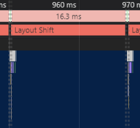

# Sorting-Algorithm-Visualization

🌍 배포 링크: https://vaco-breaker.github.io/sorting-algorithm-visualization/

> 개발 기간: 2024. 09. 09 ~ 2024. 09. 15  
> 팀: vaco-breaker

### 팀원 소개

<table>
  <tbody>
    <tr>
      <td align="center"><a href="https://github.com/SsongQ-92" target="_blank">
      <b>송규경🙋‍♂️</b></a> </td>
      <td align="center"><a href="https://github.com/howyoujini" target="_blank">
      <b>홍유진🙋‍♀️</b></a> </td>
      <td align="center"><a href="https://github.com/Seongnam-si" target="_blank">
      <b>홍성남🙋‍♂️</b></a> </td>
      <td align="center"><a href="https://github.com/Frogman113" target="_blank">
      <b>김동현🙋‍♂️</b></a> </td>
    </tr>
  </tbody>
</table>

 

### 프로젝트 소개

4가지 정렬 알고리즘에 대해서 공부하고 애니메이션으로 구현하기
- Bubble
- Insertion
- Merge
- Selection 

 

### 새롭게 배운 것과 적용해 본 것

#### 1. requireAnimationFrame(rAF)

우리가 보는 화면은 프레임의 연속이다. 보통은 모니터 주사율이 60Hz기 때문에 화면 갱신 속도도 60fps이고 이는 16ms 마다 하나의 프레임이 생성된다는 것을 의미한다. 다시 말하면, 브라우저가 `정상적으로` 60fps를 보여주려면 16.7ms 안에 1frame이 화면에 그려져야 한다.

rAF api를 사용하면 이벤트 루프가 모니터 주사율(Hz)에 맞춰 렌더링 파이프라인으로 들어가려고 노력한다. 즉, frame 렌더링할 준비가 되었을 때 frame 생성 시점마다 콜백을 실행시킴으로써 16.7ms 내에 렌더링 완료하는 것을 조금 더 확실하게 보장할 수 있다.

  

rAF를 동작시켰을 때 1프레임이 16ms로 지켜지는 모습

> https://developer.mozilla.org/en-US/docs/Web/API/Window/requestAnimationFrame

#### 2. Generator function

`function*` 선언으로 `GeneratorFunction` 객체를 생성하고, 해당 제너레이터 함수를 원할 때 나갔다가 원할 때 다시 들어갈 수 있고, 새롭게 다시 들어갈 때마다 당시의 컨텍스트가 저장된다.

`GeneratorFunction`은 호출될 때마다 이터레이터 프로토콜을 따르는 새로운 제너레이터 객체를 반환한다. 이터레이터의 `next()` 메서드가 호출되면 이터레이터에서 반환할 값을 지정하는 첫 번째 yield 표현식까지 제너레이터 함수의 본문이 실행되거나 `yield*`를 사용하여 다른 제너레이터 함수에 위임된다. `next()` 메서드는 산출된 값을 포함하는 `value` 속성과 제너레이터가 마지막 값을 산출했는지 여부를 나타내는 `done` 속성이 있는 객체를 `Boolean`로 반환한다. 

해당 GeneratorFunction의 반환 값이 이터레이터 프로토콜을 따르기 때문에 실제 코드 상에서는 `for of`문을 사용하기도 했다.

> [Generator](https://developer.mozilla.org/en-US/docs/Web/JavaScript/Reference/Global_Objects/Generator)  
> [function*](https://developer.mozilla.org/en-US/docs/Web/JavaScript/Reference/Statements/function*)

 

### 🛠 Tech Stack

  
  
  
  

