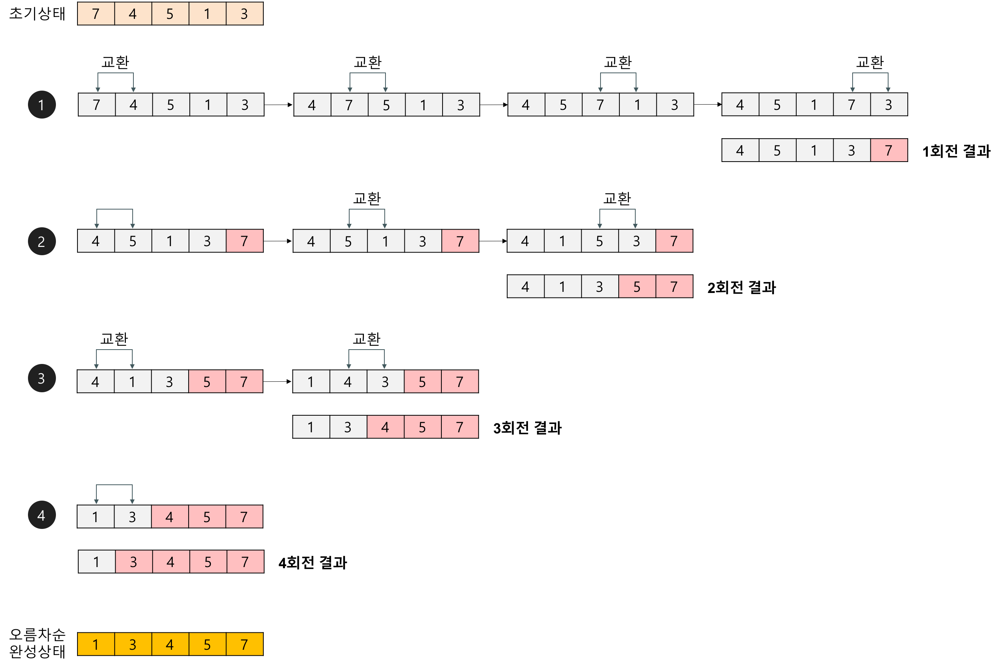
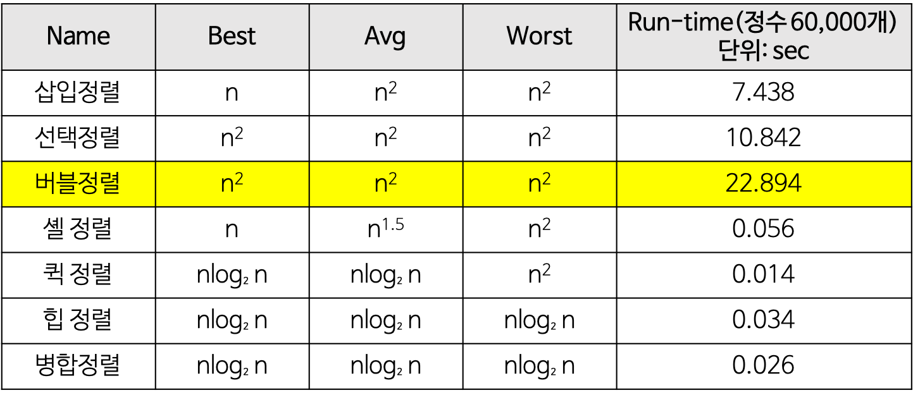
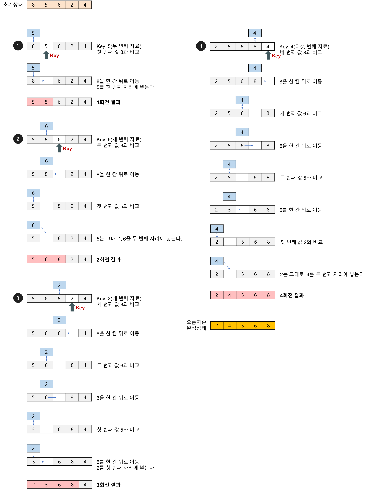
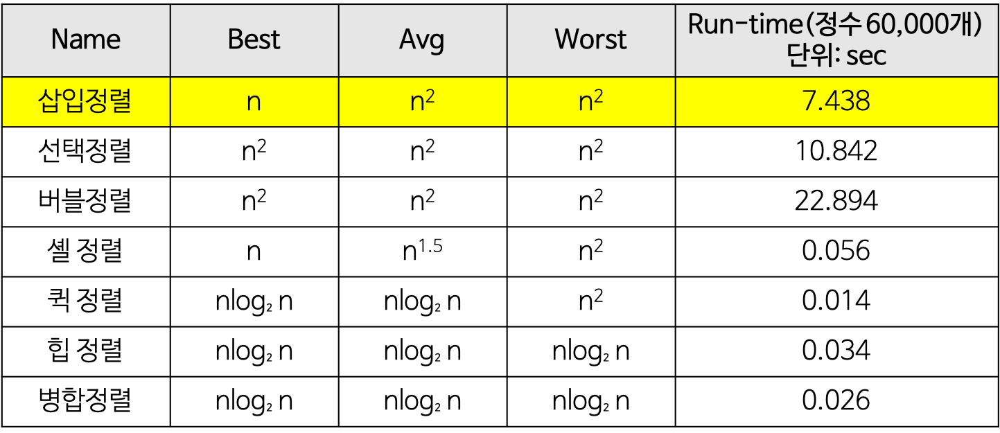
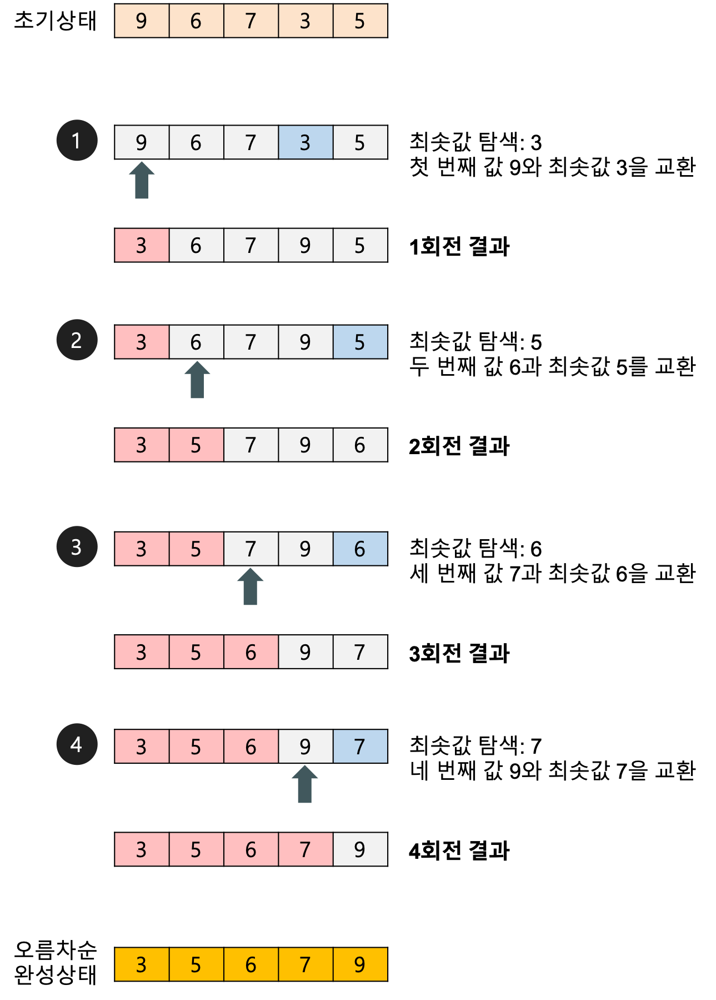
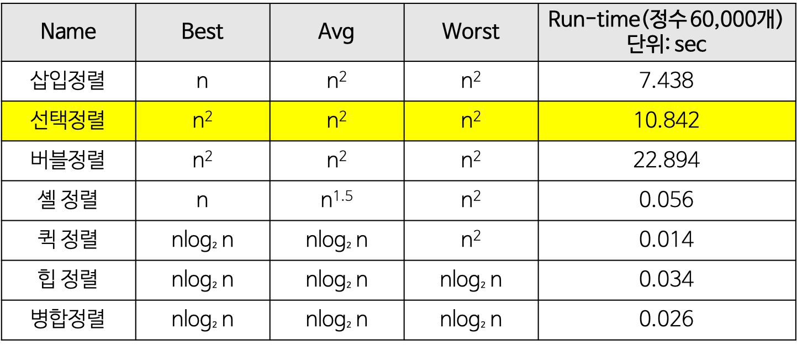
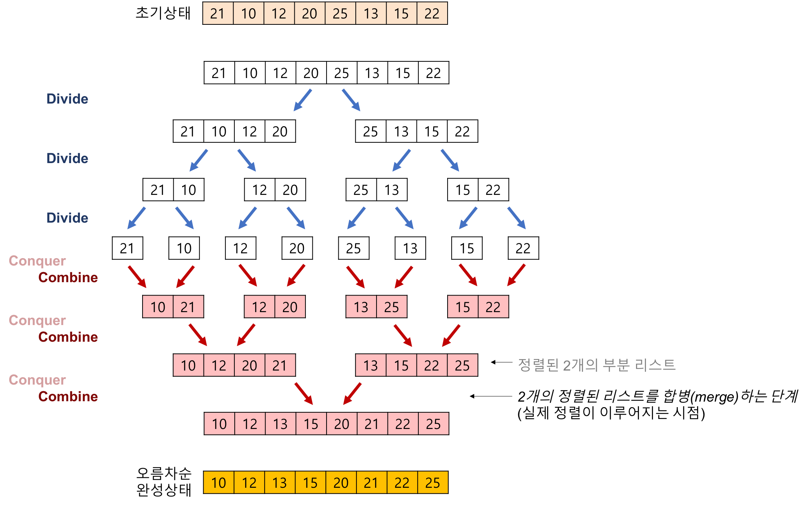
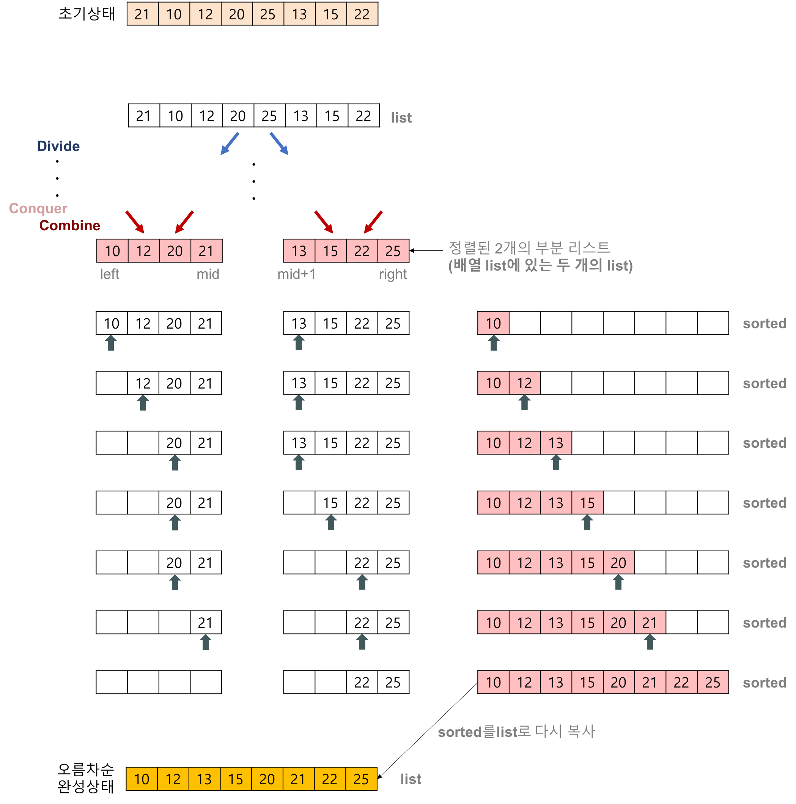
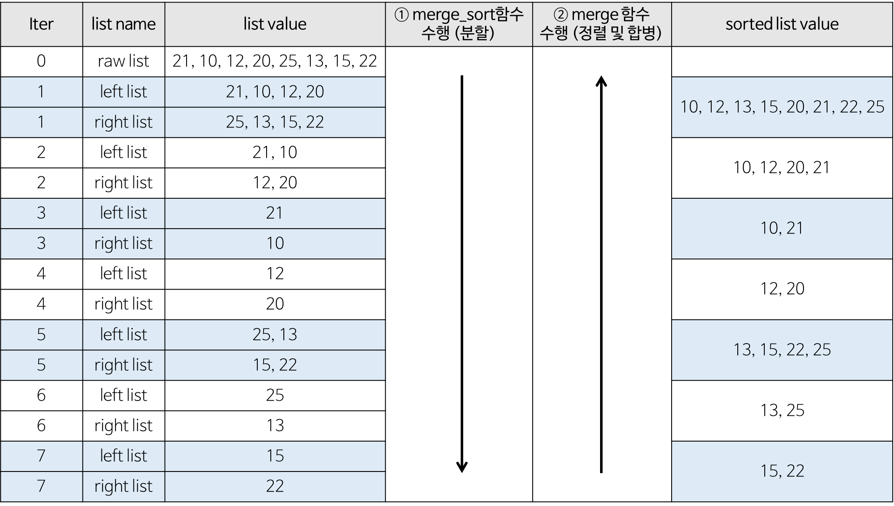
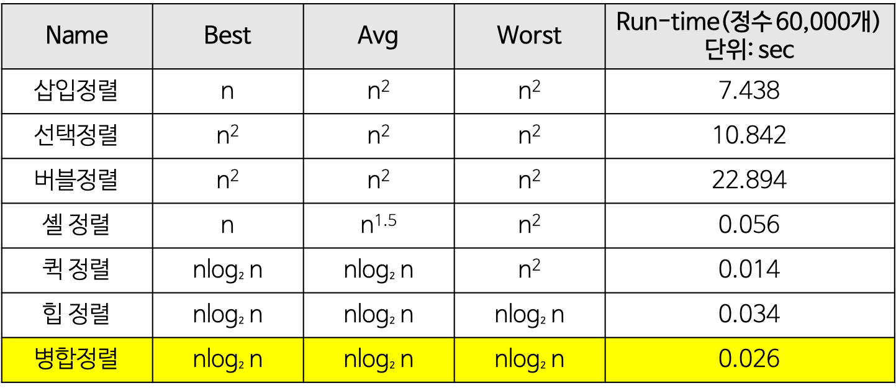

### 정렬 알고리즘이란?

특정 기준에 따라 **순서대로** 정렬하는 알고리즘  
[정렬 알고리즘의 종류]

# Bubble Sort (버블 정렬)

배열의 요소들을 **반복적으로 비교**하고 **인접한 요소들을 교환**하여 정렬하는 알고리즘  
배열의 처음부터 끝까지 i, i+1 을 무조건 비교 -> 두 요소를 교환할지, 교환하지 않을지 이후 결정  
끝까지 반복하면, 결국 가장 큰 요소가 배열의 끝으로 “버블”처럼 이동한다.

시간 복잡도: O(n^2)
공간 복잡도: O(1) (제자리 정렬)
안정 정렬 (Stable Sort)

장점
구현이 매우 간단하다.
단점
순서에 맞지 않은 요소를 인접한 요소와 교환한다.
하나의 요소가 가장 왼쪽에서 가장 오른쪽으로 이동하기 위해서는 배열에서 모든 다른 요소들과 교환되어야 한다.
특히 특정 요소가 최종 정렬 위치에 이미 있는 경우라도 교환되는 일이 일어난다.
일반적으로 자료의 교환 작업(SWAP)이 자료의 이동 작업(MOVE)보다 더 복잡하기 때문에 버블 정렬은 단순성에도 불구하고 거의 쓰이지 않는다.

시간복잡도를 계산한다면

비교 횟수
최상, 평균, 최악 모두 일정
n-1, n-2, … , 2, 1 번 = n(n-1)/2
교환 횟수
입력 자료가 역순으로 정렬되어 있는 최악의 경우, 한 번 교환하기 위하여 3번의 이동(SWAP 함수의 작업)이 필요하므로 (비교 횟수 \* 3) 번 = 3n(n-1)/2
입력 자료가 이미 정렬되어 있는 최상의 경우, 자료의 이동이 발생하지 않는다.
T(n) = O(n^2)

단순(구현 간단)하지만 비효율적인 방법
삽입 정렬, 선택 정렬, 버블 정렬
복잡하지만 효율적인 방법
퀵 정렬, 힙 정렬, 합병 정렬, 기수 정렬

# Insertion 정렬

손안의 카드를 정렬하는 방법과 유사하다.
새로운 카드를 기존의 정렬된 카드 사이의 올바른 자리를 찾아 삽입한다.
새로 삽입될 카드의 수만큼 반복하게 되면 전체 카드가 정렬된다.
자료 배열의 모든 요소를 앞에서부터 차례대로 이미 정렬된 배열 부분과 비교 하여, 자신의 위치를 찾아 삽입함으로써 정렬을 완성하는 알고리즘
매 순서마다 해당 원소를 삽입할 수 있는 위치를 찾아 해당 위치에 넣는다.

삽입 정렬(insertion sort) 알고리즘의 구체적인 개념
삽입 정렬은 두 번째 자료부터 시작하여 그 앞(왼쪽)의 자료들과 비교하여 삽입할 위치를 지정한 후 자료를 뒤로 옮기고 지정한 자리에 자료를 삽입하여 정렬하는 알고리즘이다.
즉, 두 번째 자료는 첫 번째 자료, 세 번째 자료는 두 번째와 첫 번째 자료, 네 번째 자료는 세 번째, 두 번째, 첫 번째 자료와 비교한 후 자료가 삽입될 위치를 찾는다. 자료가 삽입될 위치를 찾았다면 그 위치에 자료를 삽입하기 위해 자료를 한 칸씩 뒤로 이동시킨다.
처음 Key 값은 두 번째 자료부터 시작한다.

장점
안정한 정렬 방법
레코드의 수가 적을 경우 알고리즘 자체가 매우 간단하므로 다른 복잡한 정렬 방법보다 유리할 수 있다.
대부분위 레코드가 이미 정렬되어 있는 경우에 매우 효율적일 수 있다.
단점
비교적 많은 레코드들의 이동을 포함한다.
레코드 수가 많고 레코드 크기가 클 경우에 적합하지 않다.

시간복잡도를 계산한다면

최선의 경우
비교 횟수
이동 없이 1번의 비교만 이루어진다.
외부 루프: (n-1)번
Best T(n) = O(n)

최악의 경우(입력 자료가 역순일 경우)
비교 횟수
외부 루프 안의 각 반복마다 i번의 비교 수행
외부 루프: (n-1) + (n-2) + … + 2 + 1 = n(n-1)/2 = O(n^2)
교환 횟수
외부 루프의 각 단계마다 (i+2)번의 이동 발생
n(n-1)/2 + 2(n-1) = (n^2+3n-4)/2 = O(n^2)
Worst T(n) = O(n^2)

단순(구현 간단)하지만 비효율적인 방법
삽입 정렬, 선택 정렬, 버블 정렬
복잡하지만 효율적인 방법
퀵 정렬, 힙 정렬, 합병 정렬, 기수 정렬

# Selection 정렬

제자리 정렬(in-place sorting) 알고리즘의 하나
입력 배열(정렬되지 않은 값들) 이외에 다른 추가 메모리를 요구하지 않는 정렬 방법
해당 순서에 원소를 넣을 위치는 이미 정해져 있고, 어떤 원소를 넣을지 선택하는 알고리즘
첫 번째 순서에는 첫 번째 위치에 가장 최솟값을 넣는다.
두 번째 순서에는 두 번째 위치에 남은 값 중에서의 최솟값을 넣는다.
…
과정 설명
주어진 배열 중에서 최솟값을 찾는다.
그 값을 맨 앞에 위치한 값과 교체한다(패스(pass)).
맨 처음 위치를 뺀 나머지 리스트를 같은 방법으로 교체한다.
하나의 원소만 남을 때까지 위의 1~3 과정을 반복한다.

선택 정렬은 첫 번째 자료를 두 번째 자료부터 마지막 자료까지 차례대로 비교하여 가장 작은 값을 찾아 첫 번째에 놓고, 두 번째 자료를 세 번째 자료부터 마지막 자료까지와 차례대로 비교하여 그 중 가장 작은 값을 찾아 두 번째 위치에 놓는 과정을 반복하며 정렬을 수행한다.
1회전을 수행하고 나면 가장 작은 값의 자료가 맨 앞에 오게 되므로 그 다음 회전에서는 두 번째 자료를 가지고 비교한다. 마찬가지로 3회전에서는 세 번째 자료를 정렬한다.

장점
자료 이동 횟수가 미리 결정된다.
단점
안정성을 만족하지 않는다.
즉, 값이 같은 레코드가 있는 경우에 상대적인 위치가 변경될 수 있다.

시간복잡도를 계산한다면

비교 횟수
두 개의 for 루프의 실행 횟수
외부 루프: (n-1)번
내부 루프(최솟값 찾기): n-1, n-2, … , 2, 1 번
교환 횟수
외부 루프의 실행 횟수와 동일. 즉, 상수 시간 작업
한 번 교환하기 위하여 3번의 이동(SWAP 함수의 작업)이 필요하므로 3(n-1)번
T(n) = (n-1) + (n-2) + … + 2 + 1 = n(n-1)/2 = O(n^2)

# Merge 정렬

‘존 폰 노이만(John von Neumann)’이라는 사람이 제안한 방법
일반적인 방법으로 구현했을 때 이 정렬은 안정 정렬 에 속하며, 분할 정복 알고리즘의 하나 이다.
분할 정복(divide and conquer) 방법
문제를 작은 2개의 문제로 분리하고 각각을 해결한 다음, 결과를 모아서 원래의 문제를 해결하는 전략이다.
분할 정복 방법은 대개 순환 호출을 이용하여 구현한다.
과정 설명
리스트의 길이가 0 또는 1이면 이미 정렬된 것으로 본다. 그렇지 않은 경우에는
정렬되지 않은 리스트를 절반으로 잘라 비슷한 크기의 두 부분 리스트로 나눈다.
각 부분 리스트를 재귀적으로 합병 정렬을 이용해 정렬한다.
두 부분 리스트를 다시 하나의 정렬된 리스트로 합병한다.

합병 정렬(merge sort) 알고리즘의 구체적인 개념
하나의 리스트를 두 개의 균등한 크기로 분할하고 분할된 부분 리스트를 정렬한 다음, 두 개의 정렬된 부분 리스트를 합하여 전체가 정렬된 리스트가 되게 하는 방법이다.
합병 정렬은 다음의 단계들로 이루어진다.
분할(Divide): 입력 배열을 같은 크기의 2개의 부분 배열로 분할한다.
정복(Conquer): 부분 배열을 정렬한다. 부분 배열의 크기가 충분히 작지 않으면 순환 호출 을 이용하여 다시 분할 정복 방법을 적용한다.
결합(Combine): 정렬된 부분 배열들을 하나의 배열에 합병한다.
합병 정렬의 과정
추가적인 리스트가 필요하다.
각 부분 배열을 정렬할 때도 합병 정렬을 순환적으로 호출하여 적용한다.
합병 정렬에서 실제로 정렬이 이루어지는 시점은 2개의 리스트를 합병(merge)하는 단계 이다.

배열에 27, 10, 12, 20, 25, 13, 15, 22이 저장되어 있다고 가정하고 자료를 오름차순으로 정렬해 보자.
2개의 정렬된 리스트를 합병(merge)하는 과정
2개의 리스트의 값들을 처음부터 하나씩 비교하여 두 개의 리스트의 값 중에서 더 작은 값을 새로운 리스트(sorted)로 옮긴다.
둘 중에서 하나가 끝날 때까지 이 과정을 되풀이한다.
만약 둘 중에서 하나의 리스트가 먼저 끝나게 되면 나머지 리스트의 값들을 전부 새로운 리스트(sorted)로 복사한다.
새로운 리스트(sorted)를 원래의 리스트(list)로 옮긴다.

합병 정렬(merge sort) 알고리즘의 특징
단점
만약 레코드를 배열(Array)로 구성하면, 임시 배열이 필요하다.
제자리 정렬(in-place sorting)이 아니다.
레크드들의 크기가 큰 경우에는 이동 횟수가 많으므로 매우 큰 시간적 낭비를 초래한다.
장점
안정적인 정렬 방법
데이터의 분포에 영향을 덜 받는다. 즉, 입력 데이터가 무엇이든 간에 정렬되는 시간은 동일하다. (O(nlog₂n)로 동일)
만약 레코드를 연결 리스트(Linked List)로 구성하면, 링크 인덱스만 변경되므로 데이터의 이동은 무시할 수 있을 정도로 작아진다.
제자리 정렬(in-place sorting)로 구현할 수 있다.
따라서 크기가 큰 레코드를 정렬할 경우에 연결 리스트를 사용한다면, 합병 정렬은 퀵 정렬을 포함한 다른 어떤 졍렬 방법보다 효율적이다.
합병 정렬(merge sort)의 시간복잡도
시간복잡도를 계산한다면

분할 단계
비교 연산과 이동 연산이 수행되지 않는다.
합병 단계
비교 횟수

순환 호출의 깊이 (합병 단계의 수)
레코드의 개수 n이 2의 거듭제곱이라고 가정(n=2^k)했을 때, n=2^3의 경우, 2^3 -> 2^2 -> 2^1 -> 2^0 순으로 줄어들어 순환 호출의 깊이가 3임을 알 수 있다. 이것을 일반화하면 n=2^k의 경우, k(k=log₂n)임을 알 수 있다.
k=log₂n
각 합병 단계의 비교 연산
크기 1인 부분 배열 2개를 합병하는 데는 최대 2번의 비교 연산이 필요하고, 부분 배열의 쌍이 4개이므로 24=8번의 비교 연산이 필요하다. 다음 단계에서는 크기 2인 부분 배열 2개를 합병하는 데 최대 4번의 비교 연산이 필요하고, 부분 배열의 쌍이 2개이므로 42=8번의 비교 연산이 필요하다. 마지막 단계에서는 크기 4인 부분 배열 2개를 합병하는 데는 최대 8번의 비교 연산이 필요하고, 부분 배열의 쌍이 1개이므로 8*1=8번의 비교 연산이 필요하다. 이것을 일반화하면 하나의 합병 단계에서는 최대 n번의 비교 연산을 수행함을 알 수 있다.
최대 n번
순환 호출의 깊이 만큼의 합병 단계 * 각 합병 단계의 비교 연산 = nlog₂n
이동 횟수
순환 호출의 깊이 (합병 단계의 수)
k=log₂n
각 합병 단계의 이동 연산
임시 배열에 복사했다가 다시 가져와야 되므로 이동 연산은 총 부분 배열에 들어 있는 요소의 개수가 n인 경우, 레코드의 이동이 2n번 발생한다.
순환 호출의 깊이 만큼의 합병 단계 \* 각 합병 단계의 이동 연산 = 2nlog₂n
T(n) = nlog₂n(비교) + 2nlog₂n(이동) = 3nlog₂n = O(nlog₂n)

